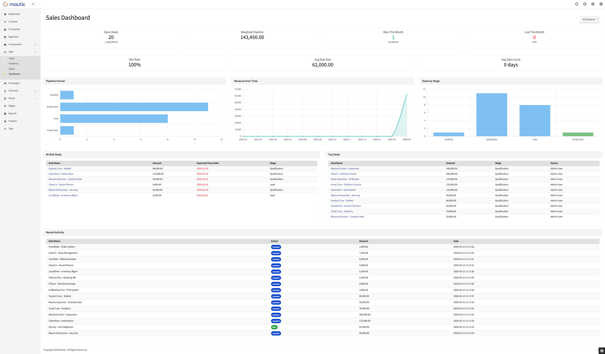
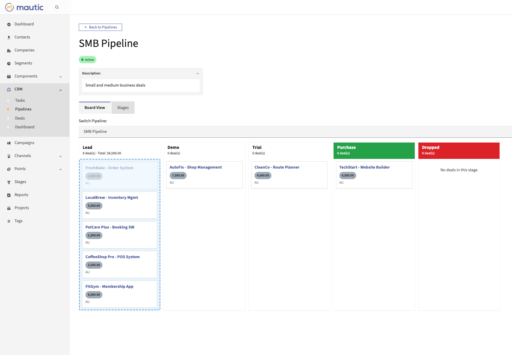

# Mautic CRM Plugin (by Mautomic)

HubSpot-style CRM plugin for [Mautic](https://mautic.org/) 7 — deals, pipelines, tasks, and notes.

## Screenshots


*Sales Dashboard — KPI cards, pipeline funnel, revenue trends, at-risk deals, and recent activity*


*Pipeline Board View — Kanban-style deal management with drag-and-drop stages*

## Features

- **Sales Dashboard**: KPI cards (open deals, weighted forecast, win rate, avg deal size, avg sales cycle), Chart.js charts (pipeline funnel, revenue over time, deals by stage), at-risk deals, top deals, and recent activity tables with pipeline filtering
- **Pipelines & Stages**: Configurable sales pipelines with ordered stages, probabilities, and win/loss types — includes Kanban board view
- **Deals**: Track revenue opportunities linked to contacts, companies, and pipeline stages
- **Tasks**: Action items with due dates, priorities, and user assignment
- **Notes**: Log calls, meetings, and general notes on deals and contacts
- **Permissions**: Full role-based access control (view own, edit own, etc.)
- **REST API**: Full CRUD API for deals, pipelines, tasks, and forecast data

## Requirements

- Mautic 7.0+
- PHP 8.2+

## Installation

### Via Composer (recommended)

```bash
composer require mautomic/mautic-crm-bundle
php bin/console mautic:plugins:reload
```

### Manual

1. Download and extract to `plugins/MautomicCrmBundle/`
2. Run `php bin/console mautic:plugins:reload`
3. Clear cache: `php bin/console cache:clear`

## Development

See the [development harness](https://github.com/mautomic-com/mautic-crm-harness) for full development setup, testing, and CI infrastructure.

Quick setup:

```bash
# Clone repos as siblings
git clone https://github.com/mautomic-com/mautic-crm-bundle.git
git clone https://github.com/mautomic-com/mautic-crm-harness.git

# Link into your Mautic installation
./mautic-crm-harness/harness/setup.sh /path/to/mautic ./mautic-crm-bundle

# Run validation
./mautic-crm-harness/harness/validate-pr.sh /path/to/mautic ./mautic-crm-bundle
```

## License

GPL-3.0-or-later
