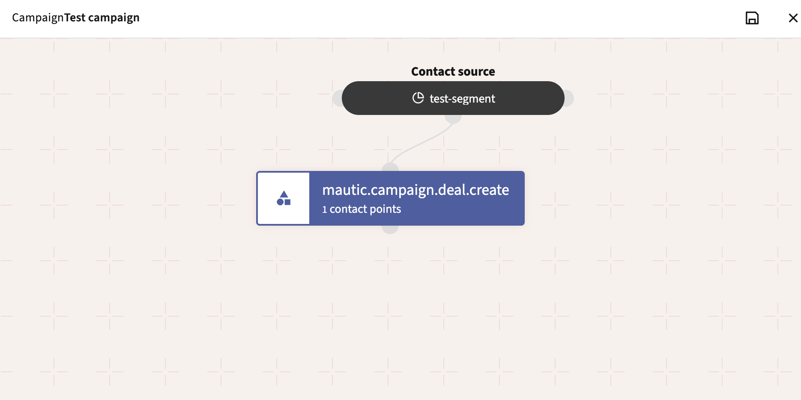
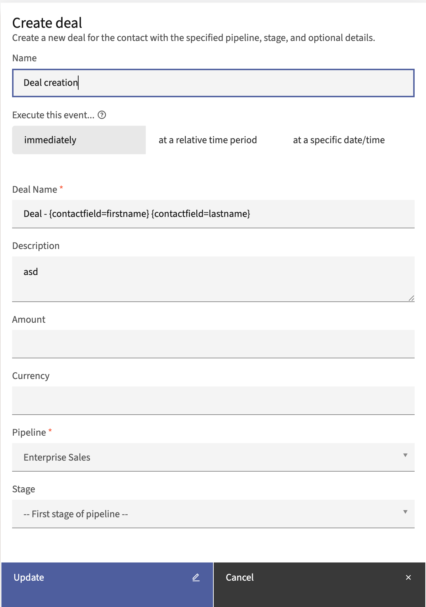

# Mautic CRM Plugin (by Mautomic)

HubSpot-style CRM plugin for [Mautic](https://mautic.org/) 7 — deals, pipelines, tasks, and notes.

## Screenshots


*Sales Dashboard — KPI cards, pipeline funnel, revenue trends, at-risk deals, and recent activity*


*Pipeline Board View — Kanban-style deal management with drag-and-drop stages*

## Features

- **Sales Dashboard**: KPI cards (open deals, weighted forecast, win rate, avg deal size, avg sales cycle), Chart.js charts (pipeline funnel, revenue over time, deals by stage), at-risk deals, top deals, and recent activity tables with pipeline filtering
- **Pipelines & Stages**: Configurable sales pipelines with ordered stages, probabilities, and win/loss types — includes Kanban board view
- **Deals**: Track revenue opportunities linked to contacts, companies, and pipeline stages
- **Tasks**: Action items with due dates, priorities, and user assignment
- **Notes**: Log calls, meetings, and general notes on deals and contacts
- **Campaign Integration**: Create deals automatically from Mautic campaign workflows
- **Permissions**: Full role-based access control (view own, edit own, etc.)
- **REST API**: Full CRUD API for deals, pipelines, tasks, and forecast data

## Campaign Integration: Create Deal Action

The plugin adds a **Create Deal** action to Mautic's campaign builder. When a contact reaches this action in a campaign flow, a new deal is automatically created and linked to that contact.

### Setting Up a Campaign with Deal Creation

1. **Create a segment** to define which contacts will enter the campaign (e.g. "New Leads", "Enterprise Prospects")
2. **Create a new campaign** and select the segment as the contact source
3. **Add the "Create Deal" action** from the action menu in the campaign builder


*Campaign builder showing a segment source connected to the Create Deal action*

### Configuring the Create Deal Action

The action form lets you configure all deal properties:


*Create Deal action configuration form in the campaign builder*

| Field | Required | Description |
|-------|----------|-------------|
| **Deal Name** | Yes | Name for the created deal. Supports contact field tokens (see below). |
| **Description** | No | Optional description for the deal. |
| **Amount** | No | Deal value. Leave empty if not applicable. |
| **Currency** | No | Three-letter currency code (e.g. `USD`, `EUR`, `GBP`). |
| **Pipeline** | Yes | Which sales pipeline to create the deal in. |
| **Stage** | No | Starting stage within the pipeline. Defaults to the first stage if not specified. |

### Contact Field Tokens

The **Deal Name** field supports `{contactfield=X}` tokens that are replaced with the contact's actual field values when the deal is created. This allows each deal to be uniquely named per contact.

**Examples:**

| Template | Result |
|----------|--------|
| `Deal - {contactfield=firstname} {contactfield=lastname}` | Deal - John Doe |
| `{contactfield=company} - Enterprise License` | Acme Corp - Enterprise License |
| `Onboarding - {contactfield=email}` | Onboarding - john@example.com |

**Supported tokens include:** `firstname`, `lastname`, `email`, `company`, `city`, `country`, `phone`, and any custom contact field alias.

### Running the Campaign

After publishing the campaign, deals are created when the campaign cron jobs run:

```bash
# Rebuild segment membership
php bin/console mautic:segments:update

# Add contacts to campaigns based on segments
php bin/console mautic:campaigns:rebuild

# Evaluate and trigger campaign events
php bin/console mautic:campaigns:trigger

# Execute queued campaign actions (including deal creation)
php bin/console mautic:campaigns:execute
```

In production, these commands should be scheduled via cron (typically every 1-5 minutes).

## Requirements

- Mautic 7.0+
- PHP 8.2+

## Installation

### Via Composer (recommended)

```bash
composer require mautomic/mautic-crm-bundle
php bin/console mautic:plugins:reload
```

### Manual

1. Download and extract to `plugins/MautomicCrmBundle/`
2. Run `php bin/console mautic:plugins:reload`
3. Clear cache: `php bin/console cache:clear`

## Development

See the [development harness](https://github.com/mautomic-com/mautic-crm-harness) for full development setup, testing, and CI infrastructure.

Quick setup:

```bash
# Clone repos as siblings
git clone https://github.com/mautomic-com/mautic-crm-bundle.git
git clone https://github.com/mautomic-com/mautic-crm-harness.git

# Link into your Mautic installation
./mautic-crm-harness/harness/setup.sh /path/to/mautic ./mautic-crm-bundle

# Run validation
./mautic-crm-harness/harness/validate-pr.sh /path/to/mautic ./mautic-crm-bundle
```

## License

GPL-3.0-or-later
